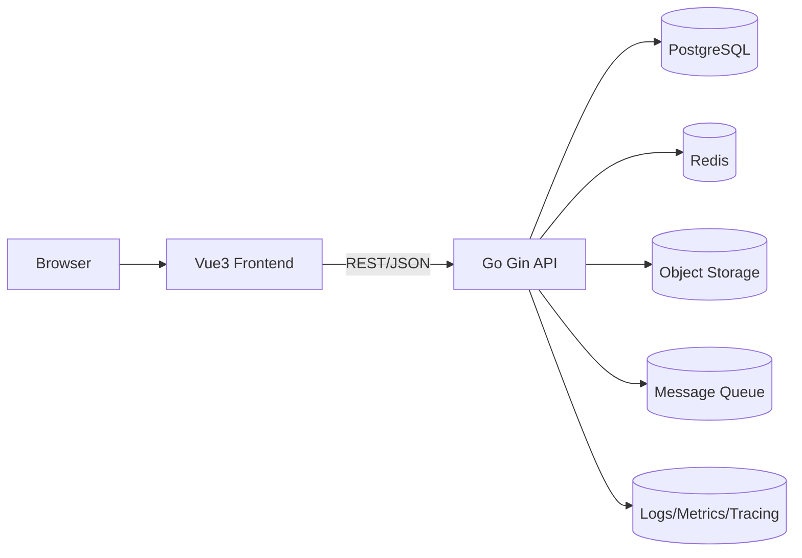

# 系统架构概览

```mermaid
flowchart LR
  Client[Browser] --> FE[Vue3 Frontend]
  FE -->|REST/JSON| API[Go Gin API]
  API --> DB[(PostgreSQL)]
  API --> Cache[(Redis)]
  API --> Obj[(Object Storage)]
  API --> MQ[(Message Queue)]
  API --> Obs[(Logs/Metrics/Tracing)]
```

说明：
- 租户上下文通过 `X-Tenant-ID` 进入后端，并在中间件注入。
- 数据隔离以逻辑隔离为主（`tenant_id` 贯穿所有业务表）。
