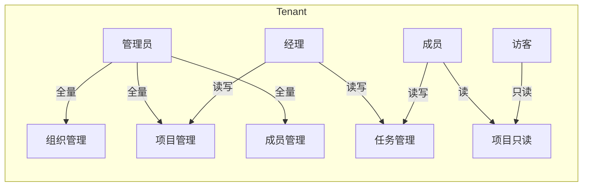

# 权限边界与角色

```mermaid
flowchart LR
  subgraph Tenant
    Admin[管理员] -->|全量| OrgMgmt[组织管理]
    Admin -->|全量| ProjectMgmt[项目管理]
    Admin -->|全量| UserMgmt[成员管理]

    Manager[经理] -->|读写| ProjectMgmt
    Manager -->|读写| TaskMgmt[任务管理]

    Member[成员] -->|读写| TaskMgmt
    Member -->|读| ProjectRead[项目只读]

    Guest[访客] -->|只读| ProjectRead
  end
```

边界说明：
- 任何请求必须携带租户上下文（`X-Tenant-ID`）。
- 所有业务表包含 `tenant_id`，查询必须按租户过滤。
- 接口权限在路由层与业务层双重校验（后续阶段实现）。
